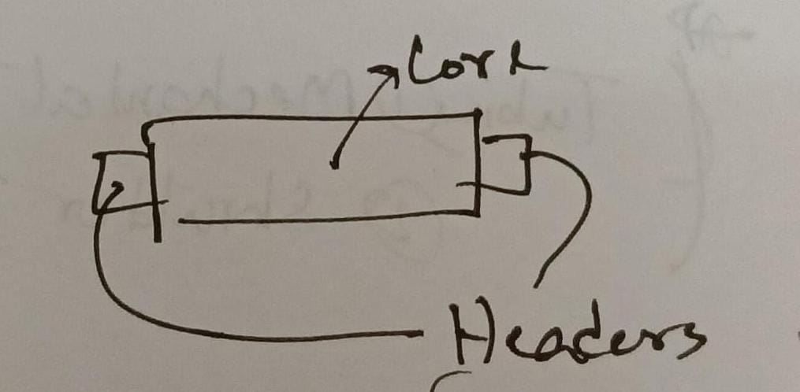

# Sheet Metal Section

In Charge: Mr. Hanjala SSAE (M)
---

What the section does:
1. Traction motor + Axle box -> build up
2. radiator repair
3. fuel tank repair
4. water tank repair
5. Main air reservoir
6. Hood repair
7. Hood repair
8. Chassis
9. Paint work
---

Arc welding is used for build up process

CaO is used for cooling of built up axle motor.
(because if water used -> cracks... if naturally cooeld -> hardness so high that boring machines cannot bore it to standard size)

---

Radiator

after separating the core, 24hrs dipped inside a mix of water, sodium triphosphate, soda, soft soap.

then jet cleaning of the core

headed fitted to the core

then, radiator leakage test.
(30-35 psi water pressure)

tubing can be of x2 types:
1. mechanical type
2. shoulder type

---

Fuel Tank

upper part cut off then jet cleaning of the tank.

after that, upper part welded.
---

Water Tank
two types
26,27,29
vs
64,65

cleaning process:
first put water
then soda mix

basically cleaning and leakage test of water tank are the only two task done at this section.

leakage thakle leak proof korte hobe (by welding or something)

water er moddhe deoa hoy Nalco.

## Main air reservoir

compressor je air toiri kore eita ekhane joma hoy.

cleaning and leakage test

braking, horn, window wiper er jonno compressed air lage eita ekhane lage

## Hood

onekgula palla thake
ekta certain structure thake, need to maintain

kichu baka hole hydraulic press machine use kora hoy

hammering etc to hoy e.

## Chassis
most important

doroja change, janala change, hand rail change

buffer, padestal, engine bed, compressor bed, alternator bed

## Painting
koyek dhap e rong kora

first entry r pore shirish kagoj diye tule zinc chromate paint kora hoy

second: pudding mara hoy, ghoshe tule color deoa hoy (primer)... shesh e ekta foundation color mara hoy

third: spray korbo after trial run, just before handover

Sand Blast plant ache... but eita ekhon chalano jacche na, because of manpower shortage.

rong er kichu nam:
1. paint light stone finishing
2. rail blue finishing
3. light blue finishing
4. black finishing
5. red signal
6. aluminilium

manpower:
60% to 70% manpower ghatti.
material issue.